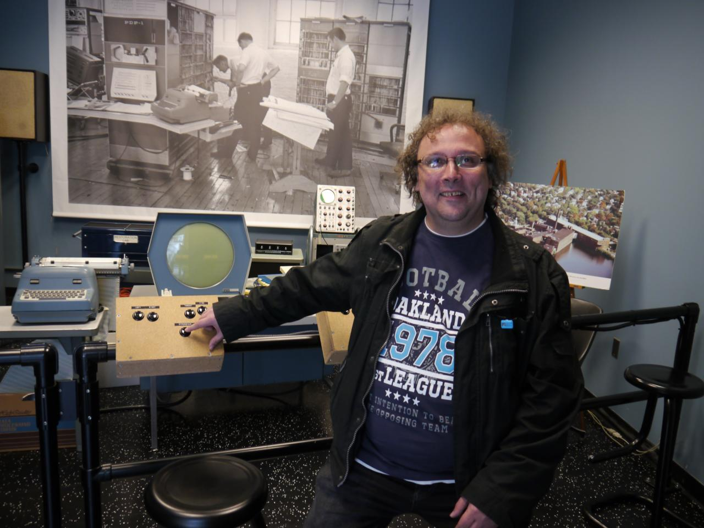
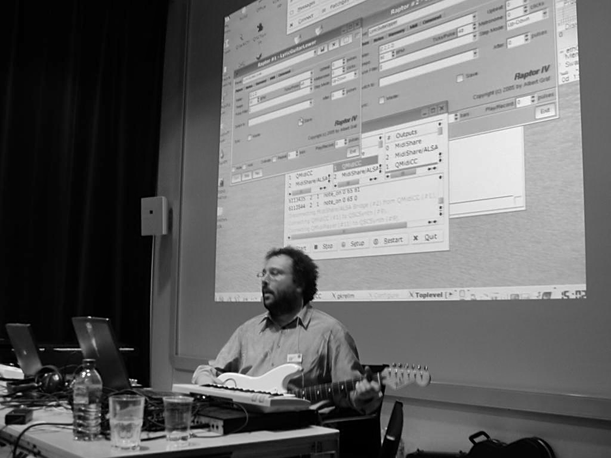
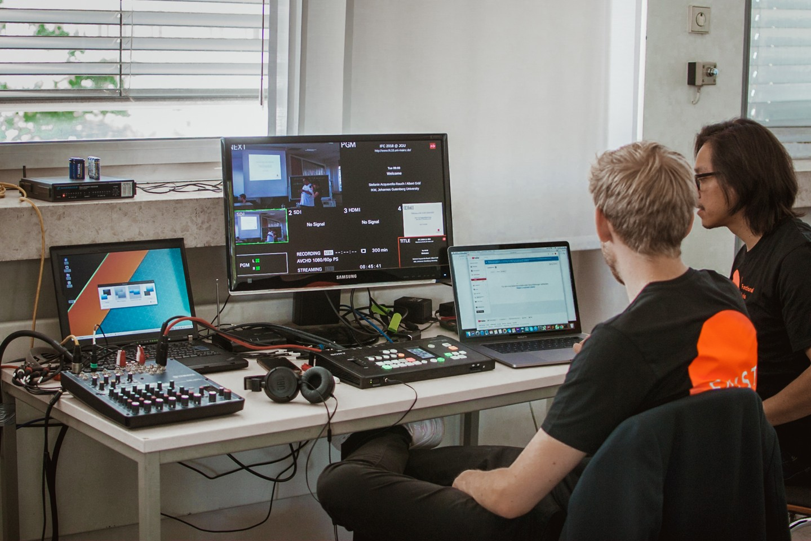

# Welcome!

You've reached Albert Gräf's presence on Github. I'm a [computer scientist and mathematician](aboutme.md) working at the [Johannes Gutenberg University][0] (JGU) at Mainz, Germany. Here you can find pointers to the source code and documentation of my functional programming language [Pure][1] and some related projects, as well as some other 3rd party projects I'm involved in, most notably Jonathan Wilkes' [Purr Data][21]. In particular, there's also some software for [Faust][5], Grame's functional dsp programming language, [Lua][23], PUC Rio's nifty little script language, [Pd][7], Miller Puckette's graphical computer music and multimedia environment, and Dave Robillard's [LV2][11], the new audio and MIDI plugin standard for Linux and other Unix systems.

Please note that this site is in a perpetual state of construction, and also serves as a grab bag for various other side projects. I will hopefully turn it into a full website some time, but for the time being, here's a brief overview of the available projects. (Most of my projects are on Github these days, but some of the older stuff is still hosted on Bitbucket at this point.)

## The Pure programming language

This is one of my flagship projects, a functional programming language based on [term rewriting](https://en.wikipedia.org/wiki/Rewriting) featuring an [LLVM](http://llvm.org/) JIT compiler backend and a fairly extensive collection of add-on modules. The project has been somewhat dormant in the past few years, as I've been working on other things, and it requires the old [LLVM 3.5](https://releases.llvm.org/download.html#3.5.0) version, but it's still perfectly usable. I'd say that there's nothing else quite like it in the crowded space of modern programming languages, so give it a try!

* The [pure-lang][2] source code repository has the source code of the Pure programming language interpreter and various addon modules. In particular, there are the [pd-pure](https://agraef.github.io/pure-docs/pd-pure.html) and [pd-faust](https://agraef.github.io/pure-docs/pd-faust.html) modules which let you run Pure and Faust programs as Pd externals.

* For beginners, I recommend the [Pure Quick Reference][4] guide which provides a (relatively) quick overview of the language. Also, the Pure Language and Library Documentation is available in [html][3a] and [pdf][3b] format.

* [sublime-pure](https://github.com/agraef/sublime-pure) provides Pure language support for the [Sublime Text](http://www.sublimetext.com/) editor.

* The [pygments-lexer-pure](https://github.com/agraef/pygments-lexer-pure) addon lets you highlight Pure syntax using [Pygments](http://pygments.org/).

## Purr Data

Another flagship project that I contribute to is Jonathan Wilkes' [Purr Data](https://git.purrdata.net/jwilkes/purr-data), which is a flavor of Miller Puckette's venerable [Pd][7] with a modern GUI and lots of bundled externals. Purr Data is a cross-platform version of Ico Bukvic’s [Pd-l2ork][10], which in turn was forked from Hans-Christoph Steiner’s (popular, but discontinued) [Pd-extended](http://puredata.info/downloads/pd-extended).

If you have been looking for a modern successor to Pd-extended, this is it. I've been using Purr Data in pretty much all my university courses since 2016, contributed a few bits and pieces over the years, and serve as co-developer, release master and Linux package maintainer in the project.

My [Purr Data Github mirror][21] provides a one-stop shop to make it easy for you to get your hands on the latest source and the available releases, including pre-built packages for Linux (maintained on the [OBS](https://build.opensuse.org/project/show/home:aggraef)), macOS, and Windows.

## The computer music and multimedia corner

Most of the software you'll find here is still written in Pure and/or C/C++. Recently I also started porting old and writing new software in the Lua language, which has a lighter runtime and is easier for beginners than Pure. Please note that with such a diverse software portfolio, the burden of maintenance becomes substantial, and thus I can't possibly keep these updated at all times. If you find any issues with any of my projects, please submit a bug report (or, preferably, a pull request).

* [faust-lv2](https://bitbucket.org/agraef/faust-lv2) is my latest and greatest version of the LV2 plugin architecture for the Faust programming language. This gives you a convenient way to create LV2 effect and instrument plugins from Faust programs.

* [midizap](https://github.com/agraef/midizap) translates Jack MIDI input to X11 keyboard and mouse events as well as MIDI output, so that you can use it to operate your favorite multimedia applications such as audio and video editors and DAW software. Note that midizap requires X11 and thus some kind of Unix system. It is a much enhanced version of my own fork of Eric Messick's ShuttlePRO program (see the "Grab Bag" below) which provides similar functionality for the Contour Design Shuttle devices. An Arch PKGBUILD is available in the [AUR](https://aur.archlinux.org/packages/midizap-git/).

* [myblocks](https://github.com/agraef/myblocks) is a simple C+Lua interface and Pd external for the [BLOCKS SDK](https://github.com/WeAreROLI/BLOCKS-SDK). This module lets you manage and control the [Roli BLOCKS](https://roli.com/products/blocks/) devices in Linux. The Pd external is written in Lua and thus requires Pd-Lua (see below). The build system currently targets Linux and requires gcc and GNU make, but the code should work on any platform supported by [JUCE](https://github.com/WeAreROLI/JUCE) and thus porting to Mac or Windows should be a piece of cake.

* [pd-faustgen2](https://github.com/agraef/pd-faustgen) or, as we call it, the "Faust compiler in a box", is an extensive update of Pierre Guillot's pd-faustgen which brings its feature set up to par with pd-faust as well as Grame's faustgen for Max. This is an alternative Faust plugin for Pd which offers some important advantages over pd-faust, most notably JIT compilation of Faust programs using Faust's LLVM backend, and support for recent LLVM versions. If you're starting out with using Faust in Pd, this is the plugin we recommend.

* [pd-jacktime](https://github.com/agraef/pd-jacktime) is a Pd external written in Lua which provides a basic interface to the Jack transport client API. This lets you sync your Pd patches to Jack time masters such as [Ardour](https://ardour.org/) and [Hydrogen](http://hydrogen-music.org). Requires [pd-lua](https://github.com/agraef/pd-lua) (and [Jack](http://jackaudio.org/), of course). An Arch PKGBUILD is available in the [AUR](https://aur.archlinux.org/packages/pd-jacktime-git/).

* [pd-lua](https://github.com/agraef/pd-lua) is a fork of umlaeute's [repository](https://anonscm.debian.org/git/pkg-multimedia/pd-lua.git) with minor touches to provide support for Lua 5.3 and 5.4. Use this to enjoy Claude Heiland-Allen's very nice Pd-Lua module which lets you program Pd externals in the [Lua](http://www.lua.org/) scripting language. An Arch PKGBUILD is available in the [AUR](https://aur.archlinux.org/packages/pd-lua-git/). Included in [Purr Data][21] as of version 2.5.  Prebuilt binaries for ARM/Intel Macs and Windows are available for use with vanilla Pd.

* [pd-lv2plugin](https://bitbucket.org/agraef/pd-lv2plugin) is an LV2 plugin host for Pd, written in Pure. It provides a Pd external `lv2plugin~` which lets you run LV2 audio and MIDI plugins in Pd.

* **New:** [mdnsbrowser](https://github.com/agraef/mdnsbrowser) is a [Zeroconf](http://en.wikipedia.org/wiki/Zero-configuration_networking) external for Pd written in Lua+C, which lets you discover and publish services in the local network, so that your Pd patches can establish network connections in an automatic fashion. This is an update for my (outdated) [pd-mdnsbrowser](https://bitbucket.org/agraef/pd-mdnsbrowser) package which was written in Pure. The new version is now written in Lua for easier installation, and thus requires pd-lua to run (see above). Prebuilt binaries for ARM/Intel Macs and Windows are available.

* [pd-smmf](https://bitbucket.org/agraef/pd-smmf): Documentation and examples for the Pd "Simple MIDI Message Format", a symbolic MIDI representation in Pd message format. This is used by most of my Pd externals using MIDI in some way, but is useful in its own right if you need to pass around MIDI data in Pd. Two abstractions midi-input.pd and midi-output.pd are included to translate between Pd's built-in MIDI I/O and SMMF. (These abstractions are just plain Pd patches which require no additional software to work, but the other examples included in the package require either pd-lua or pd-pure.)

* [pd-touchosc](https://bitbucket.org/agraef/pd-touchosc) is a TouchOSC MIDI bridge written in Pure. This is a collection of Pd externals and patches which make it easy to interface Pd to [TouchOSC][12], an OSC and MIDI control surface for Android and iOS devices. Please note that this has mostly been superseded by Spencer Jackson's osc2midi and my osc2midi-utils package (see the "Grab Bag" below).

* The [Pure LAC09 examples](https://github.com/agraef/pure-lac09) are back! You can also download them as a [tarball](https://github.com/agraef/pure-lac09/archive/1.0.tar.gz) or a [zip archive](https://github.com/agraef/pure-lac09/archive/1.0.zip) again. These are the accompanying materials for my presentation "Signal Processing in the Pure Programming Language" at the Linux Audio Conference 2009 at Parma, with some minor touches for compatibility with present-day Pure. They were originally on Pure's GoogleCode page, but got lost when GC closed its doors. Since the paper and the accompanying materials are still valid and may still be useful for Pure users, they have found a new home on Github now.

* [Raptor](https://github.com/agraef/raptor-lua): An aleatoric arpeggiator and real-time algorithmic composition program based on the mathematical music theories of the contemporary composer and pioneer of computer music [Clarence Barlow](https://en.wikipedia.org/wiki/Clarence_Barlow). Now at version 6, which is the most recent Lua-based version. (The program is implemented as a Pd patch, but the algorithmic composition core is written in Lua, so you'll need [pd-lua](https://github.com/agraef/pd-lua) to run the patch.)

* [Scale](https://github.com/agraef/scale-lua) is my graphical musical scale visualization and rationalization program. Like the Raptor patch from above, it is based on Barlow's theories. The original version of this program was written in Pure, but in recent years this has been suffering from severe incompatibilities with modern Mesa 3D library implementations (Pure and Mesa use different, and incompatible, LLVM versions, making them crash). So I ported it over to Lua, which gets rid of these problems. Note that the scale program reads and writes files in Manuel Op de Coul's [Scala](https://www.huygens-fokker.org/scala/) format, thus you can use it with Scala's extensive and ever-growing [scale archive](https://www.huygens-fokker.org/scala/downloads.html#scales). It can also export scales as sysex files in the MIDI Tuning Standard (MTS) format, just like the sclsyx program discussed below. You can use these sysex files to tune MTS-compatible synthesizers such as [Fluidsynth](http://www.fluidsynth.org/).

* [sclsyx](https://bitbucket.org/agraef/sclsyx) is a little Pure script which helps you create MIDI Tuning Standard (MTS) sysex or MIDI files from musical tunings in Manuel Op de Coul's [Scala](http://www.huygens-fokker.org/scala/) format. It can also print the sysex messages in a human-readable format on the terminal, from where you can copy and paste the data into DAWs which support manual entry of sysex messages. This program is also available as a Pd external in the [pd-smmf](https://bitbucket.org/agraef/pd-smmf) package, see above.

* [xwiimote-lua](https://github.com/agraef/xwiimote-lua) is a Pd external written in Lua which provides easy access to the Wii Remote on Linux, using the [xwiimote](http://dvdhrm.github.io/xwiimote/) library. (The package also includes a little Lua wrapper of libxwiimote which may be useful to Lua programmers who don't run Pd but are looking for a way to access the Wii Remote from Lua.)

## The Grab Bag

Here are some other related ports and utilities, as well as links to 3rd party software which you may find useful.

* [apcmini-ardour](https://github.com/agraef/apcmini-ardour): These are my Ardour bindings for the [AKAI APCmini](https://www.akaipro.com/apc-mini) controller which turn the APCmini into a useful DAW controller. There's a little [pdf](https://github.com/agraef/apcmini-ardour/blob/master/APCmini-Ardour.pdf) manual available. (This is now largely obsolete with the advent of the midizap program which also includes a Mackie emulation for the APCmini, see above.)

* [EZ-AG](https://github.com/agraef/ez-ag) is a Pd patch which aims to make it easier to use Yamaha's "learning guitar", the [Yamaha EZ-AG](https://www.bhphotovideo.com/c/product/353860-REG/Yamaha_EZAG_EZ_AG_Self_Teaching_Guitar.html), as a MIDI controller. Also works with the [Jamstik](https://jamstik.com/). Best used with [Purr Data][21].

* Peter G. Baum's [Gnocl](https://dr-baum.net/gnocl/) provides GTK+ and Gnome version 2 bindings for [Tcl](https://www.tcl.tk/). This is an older 3rd party project, but still extremely useful. I link to this here because I often use Gnocl for my graphical applications, so it's needed as a dependency. Since Gnocl binaries can be hard to find these days, I also maintain packages in the [AUR](https://aur.archlinux.org/packages?O=0&K=gnocl) (Arch User Repositories) and the [OBS](https://build.opensuse.org/project/show/home:aggraef:gnocl) (Open Build Service). There you can find Arch and Debian/Ubuntu packages for Gnocl itself, as well as the Gnocl Builder, Canvas, and GConf add-on modules. (Note that some of the required system libraries are no longer supported on recent Debian and Ubuntu releases, hence some of the Gnocl add-on modules might not be available on these systems. The core Gnocl package should always be available, though, and this will be enough for most Gnocl applications.)

* **New:** [lua-octave](https://github.com/agraef/lua-octave) and [lua-tk](https://github.com/agraef/lua-tk) are ports of my corresponding Pure modules, providing Lua bindings for [Octave](https://www.octave.org/) and [Tcl/Tk](https://www.tcl.tk/). Octave has an extensive numeric library which lets you do scientific computations with ease. Tcl/Tk is great for knocking out graphical user interfaces, and can also be used to create good-looking GTK+ GUIs using [Gnocl](https://dr-baum.net/gnocl/), see above. I did these modules to facilitate porting applications from Pure to Lua. Both modules can be installed using either [luarocks](https://luarocks.org/) or a plain old `make install`. Lua examples are included in the source. I couldn't find any similar Lua modules in the usual places, so if you're a Lua programmer then you may find these as useful as I do.

* [osc2midi-utils](https://bitbucket.org/agraef/osc2midi-utils) is a collection of utilities to deal with [TouchOSC][12] layouts and [osc2midi][20] map files. Currently it offers a converter from TouchOSC layouts to osc2midi map files and a graphical frontend to the osc2midi program, Spencer Jackson's configurable OSC-(Jack)MIDI bridge written in C. Requires Pure, as well as Tcl/Tk and Gnocl (see above).

* [rigkontrol](https://bitbucket.org/agraef/rigkontrol) is a Pd patch which translates control signals from Native Instrument's [Guitar Rig Kontrol](http://www.soundonsound.com/sos/sep04/articles/niguitar.htm#2) foot switch to MIDI CC. You'll find this patch useful if you have a Rig Kontrol device lying around which you want to put to good use by hooking it up to your DAW or other MIDI-capable hard- and software. No special externals or addons are required, so the patch should work with any Pd flavor out there. Only the Rig Kontrol 1 (the original blue one) is supported right now, but adjusting the patch to later GR Kontrol versions should be a piece of cake. :)

* [ShuttlePRO](https://github.com/agraef/ShuttlePRO) is a user program for interpreting input from a [Contour Design Shuttle](https://www.contourdesign.com/product/shuttle/) device. This is a fork of [nanosyzygy's original version](https://github.com/nanosyzygy/ShuttlePRO) which adds many enhancements such as Jack MIDI support, so that the device can also be used as a MIDI controller. An Arch PKGBUILD is available in the [AUR](https://aur.archlinux.org/packages/shuttlepro-git/).

* [VTK](https://www.vtk.org/) by Kitware is a powerful software library for 3D computer graphics, image processing, and scientific visualization. Like Gnocl, it is used in some of my programs, and so I provide ready-made packages for Arch in the [AUR](https://aur.archlinux.org/packages/vtk6-legacy), and for Debian/Ubuntu at the [OBS](https://build.opensuse.org/project/show/home:aggraef:vtk6). The version provided there is the older 6.3 version, which still includes the full set of VTK Tcl libraries. These are needed to use VTK in programming environments which are not directly supported by VTK, but have their own Tcl interface, such as Lua and Pure. The package can be installed alongside other VTK versions if needed.

## Notes

The Faust-related software has been tested and is known to work with recent Faust versions available in the [Faust git repository](https://github.com/grame-cncm/faust). For the Lua modules and externals we recommend Lua 5.3 or later (some of them such as pd-lua may also still work with Lua 5.2, but no guarantees). The Pd externals have been tested and work with both [vanilla Pd][7] and with the [pd-extended][9], [pd-l2ork][10] and [purr-data][21] distributions. (A few of the newer patches may require the latest and greatest purr-data to work properly, but this is mentioned on the corresponding project pages.)

Source tarballs and binary packages for Pure and related projects can be found on the [Download](https://github.com/agraef/pure-lang/wiki/Download) page of the Pure project.

[0]: https://www.uni-mainz.de/eng/index.php
[1]: https://agraef.github.io/pure-lang/
[2]: https://github.com/agraef/pure-lang
[3a]: https://agraef.github.io/pure-docs/
[3b]: https://agraef.github.io/pure-docs/puredoc.pdf
[4]: https://agraef.github.io/pure-lang/quickref/pure-quickref.pdf
[5]: http://faust.grame.fr/
[6]: https://github.com/agraef/pure-lang/wiki/Faust
[7]: http://msp.ucsd.edu/software.html
[8]: http://puredata.info/downloads/pure-data
[9]: http://puredata.info/downloads/pd-extended
[10]: http://l2ork.music.vt.edu/main/make-your-own-l2ork/software/
[11]: http://lv2plug.in/
[12]: http://hexler.net/software/touchosc
[13]: https://aur.archlinux.org/
[14]: https://github.com/agraef/pure-lang/wiki/ArchPackaging
[15]: https://launchpad.net/~dr-graef
[16]: http://www.macports.org/
[17]: https://github.com/agraef/pure-lang/wiki/PureOnMacOSX
[18]: https://github.com/agraef/pure-lang/wiki/PureOnWindows
[19]: http://www.steinberg.net/en/company/developers.html
[20]: https://github.com/ssj71/OSC2MIDI
[21]: https://agraef.github.io/purr-data/
[23]: https://www.lua.org/
