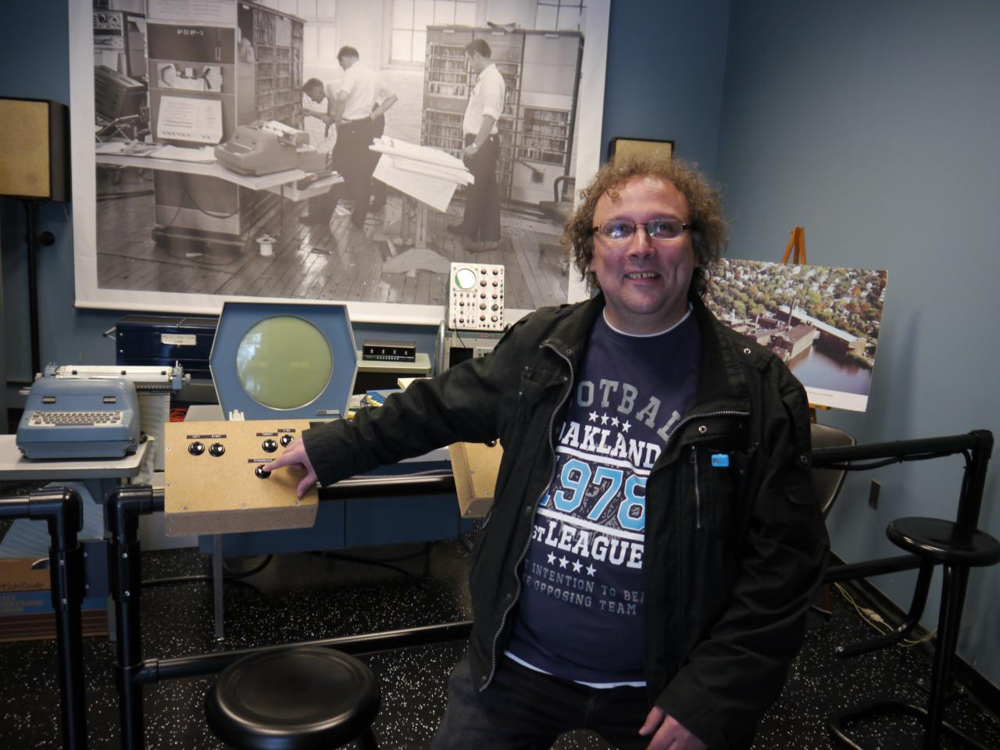
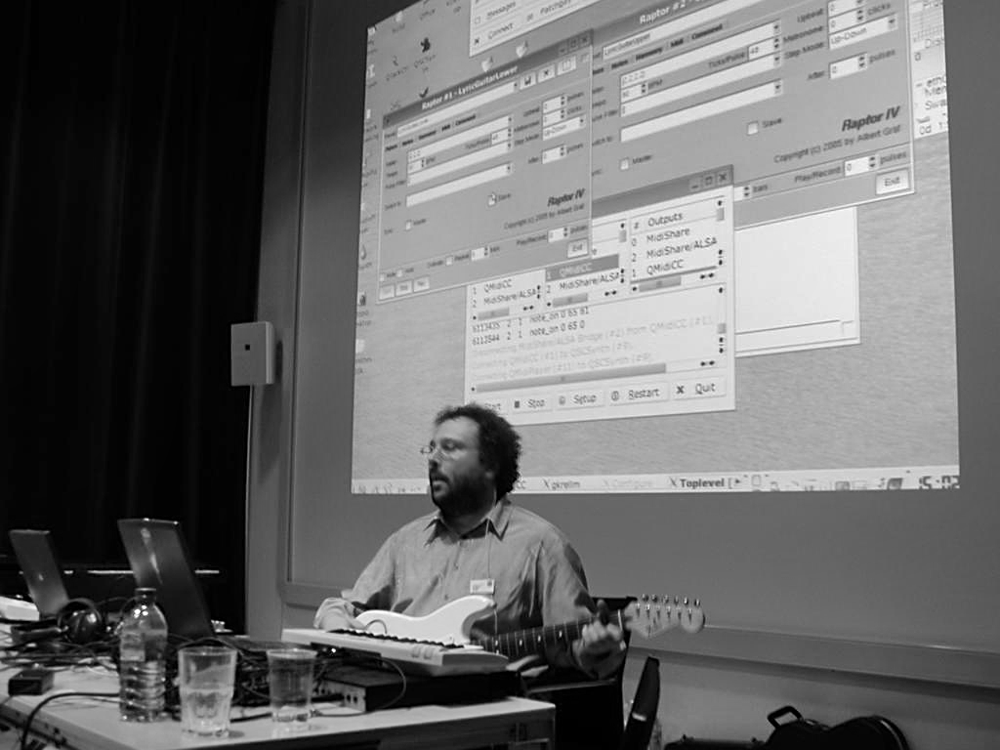
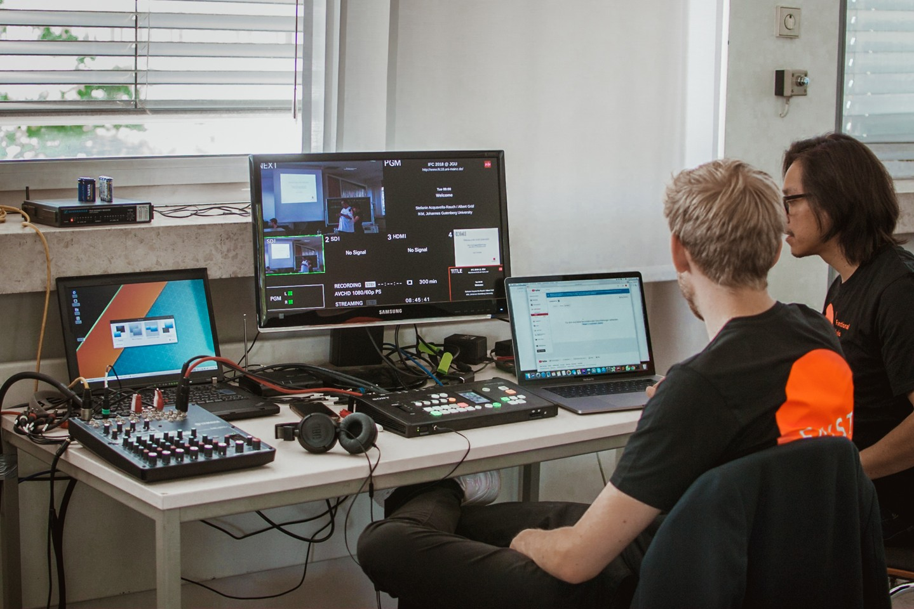

I'm a [computer scientist and mathematician][1] at the [Johannes Gutenberg University][0] (JGU) at Mainz, Germany, working in the field of [computer music][2] and media technologies. Some of my special areas of interest are the mathematical theory of music, computer software for music applications, functional programming language design and implementation, graph theory and combinatorial optimization. I am also an active member of the [Linux audio community][3] and a developer of [open source software](README.md).

Courses I am currently teaching at the university (in German): [Lehre aktuell](http://www.musikinformatik.uni-mainz.de/lehreakt.php)

[0]: https://www.uni-mainz.de/eng/index.php
[1]: http://www.musikinformatik.uni-mainz.de/e_ag.php
[2]: https://en.wikipedia.org/wiki/Computer_music
[3]: https://linuxaudio.org/
 

